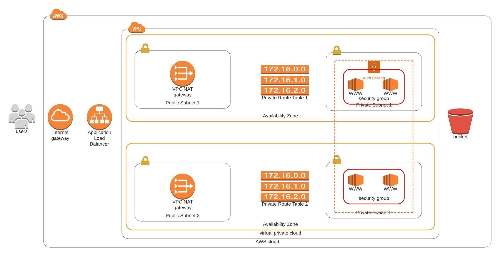

# Cloudformation templates to deploy a high availability web app

This project uses createStack and updateStack scripts to deploy Cloudformation templates. These templates include the basic resources needed to deploy a highly available Web Application in AWS.

## Templates

- baseStack.yml (VPC, Internet Gateway, Subnets, Route Tables, Nat Gateway)
- webAppStack.yml (Security Groups, Launch Config, Auto Scale Group, Load Balancer, Instance Profile)

## Deploy and Test

1. Create the baseStack: `./createStack.sh baseStack baseStack.yml baseParams.json <aws-profile-name>`
2. Create the webAppStack: `./createStack.sh webAppStack webAppStack.yml webAppParams.json <aws-profile-name>`
3. Check the outputs from the webAppStack for the test url. Export name: `<env>-URL`, Key: `WebUrl`, Example: `http://webAp-WebAp-1LPARJ63QRHQ3-127066809.us-west-2.elb.amazonaws.com`

## Technical Diagram

